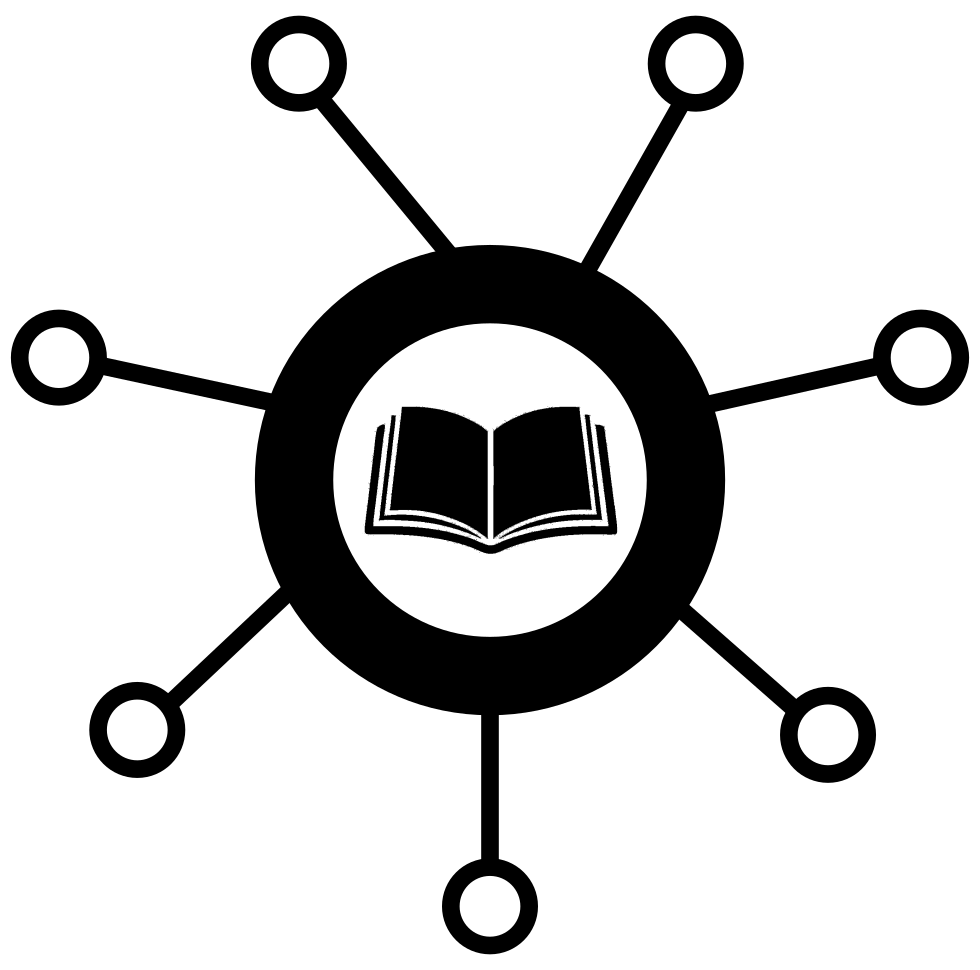

   

# Collectd unofficial reference

!!! warning "Unofficial site"

    This site is not directly affiliated with the collectd project. I offer it
    as a way to navigate collectd's existing documentation more easily; the
    authoritative sources remain the
    [collectd repository](https://github.com/collectd/collectd) and its
    [wiki](https://github.com/collectd/collectd.wiki).

collectd is a daemon that collects system and application performance metrics
and passes them on to storage back-ends, monitoring systems and message
brokers. It does the collecting; something else does the graphing and alerting.

This site documents **collectd {{ version }}**, released {{ release_date }}.

## Start here

- **[First steps]({{ base_path }}/concepts/first-steps/)** — install collectd, enable a couple
  of plugins, and confirm that values are being written.

- **[All {{ plugin_count }} plugins]({{ base_path }}/plugins/)** — one page per plugin, each
  with its dependencies, its caveats and its configuration options.

- **[collectd.conf(5)]({{ base_path }}/manpages/collectd.conf/)** — the complete
  configuration reference, section by section.

- **[Concepts]({{ base_path }}/concepts/)** — data sets, value lists, the naming schema and
  the global cache: the model everything else is built on.

## How this site is put together

collectd's documentation is spread across three places: the manual pages in the
source tree, the GitHub wiki, and collectd.org. They overlap, they disagree,
and the wiki links to a great deal that no longer exists.

Everything here is **generated** from the first two, pinned to the
{{ version }} release:

- **Configuration options** come from `src/collectd.conf.pod`, the source of
  the `collectd.conf(5)` manual page. Each plugin's section is extracted once
  and then shown in two places — on the plugin's own page, and in the full
  configuration reference. They are the same file, so they cannot drift apart.

- **Descriptions, dependencies, caveats and examples** come from the wiki,
  with its links rewritten to point into this site. Meeting minutes, release
  notes and pages about plugins that no longer ship are left out.

The [about page]({{ base_path }}/about/) has the details, and the
[link report]({{ base_path }}/about/link-report/) lists every wiki reference that could not be
salvaged.
